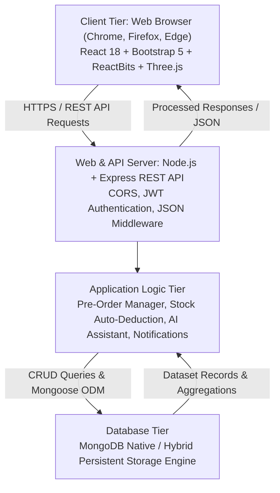
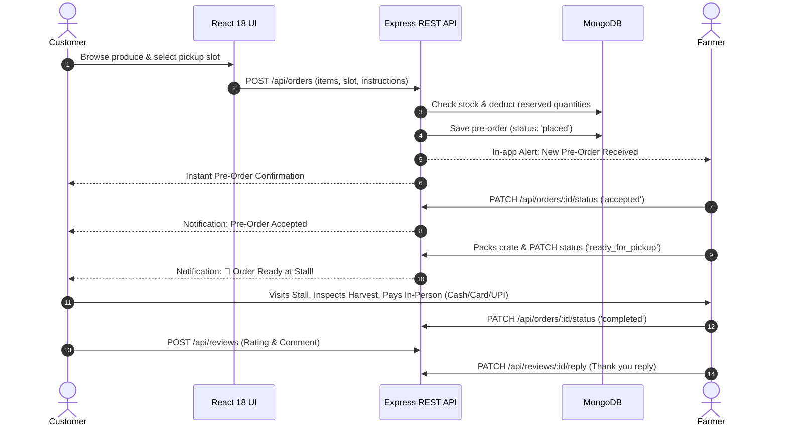
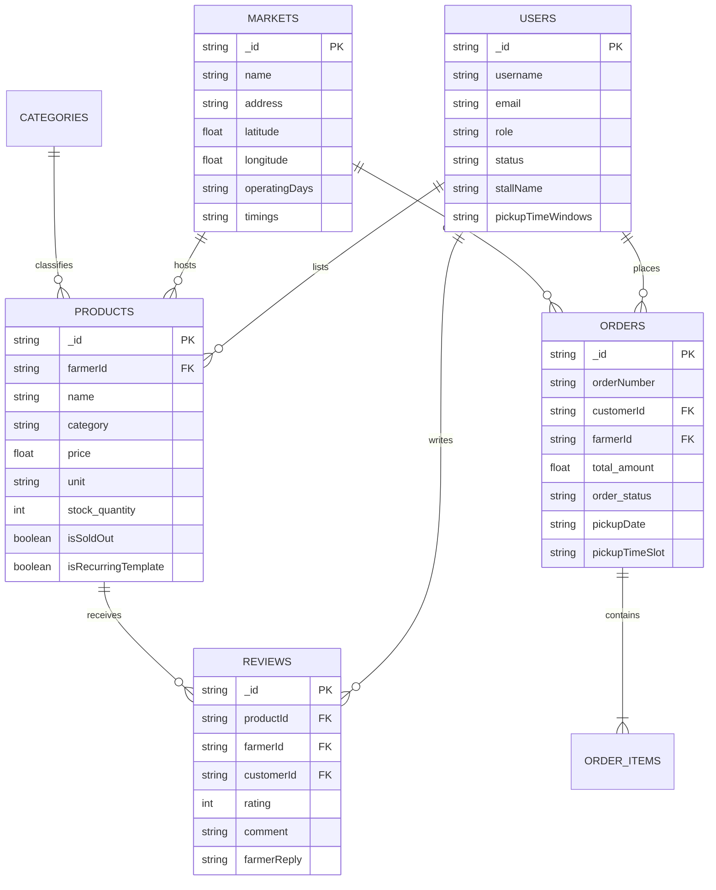

# MarketLink (eGreen Basket) — Architecture & Activity Flowcharts

**Championship:** Aptech TechWiz 7  
**Document:** System Architecture, Data Flow Diagrams (DFD), and Activity Flowcharts  
**Version:** 1.0  

---

## 1. Multi-Tier Architecture Diagram

---

## 2. Overall Platform Flow Diagram

```mermaid
flowchart TD
    Start([Start]) --> Login[User Login / Authentication]
    Login --> RoleCheck{Role Identification}

    RoleCheck -->|Admin| AdminDash[Admin Console]
    AdminDash --> M1[Verify & Approve Farmers]
    AdminDash --> M2[Activate / Deactivate Customers]
    AdminDash --> M3[Manage Farmers Markets & Coordinates]
    AdminDash --> M4[Content Moderation: Products & Reviews]
    AdminDash --> M5[Broadcast Platform Announcements]
    AdminDash --> M6[View System Revenue & Sales Reports]

    RoleCheck -->|Farmer / Vendor| FarmerDash[Farmer Stall Console]
    FarmerDash --> F1[Manage Weekly Stock & Recurring Templates]
    FarmerDash --> F2[Set Pickup Windows & Cutoff Hours]
    FarmerDash --> F3[Accept / Decline Incoming Pre-Orders]
    FarmerDash --> F4[Mark Harvest Orders Ready for Pickup]
    FarmerDash --> F5[Review Sales Insights & Revenue Summary]
    FarmerDash --> F6[Reply to Customer Feedback]

    RoleCheck -->|Customer / Shopper| CustFlow[Shopper Experience]
    CustFlow --> C1[Browse Nearby Markets & View OpenStreetMap]
    CustFlow --> C2[Search & Filter Harvest Catalog by Category/Day]
    CustFlow --> C3[Consult AI Market Assistant for Timings]
    CustFlow --> C4[Add to Basket & Reserve Pre-Order with Time Slot]
    CustFlow --> C5[Modify or Cancel Order before Farmer Cutoff]
    CustFlow --> C6[Arrive at Market Stall, Pay In-Person, & Collect]
    CustFlow --> C7[Submit Post-Order 5-Star Rating & Review]

    M1 & M2 & M3 & M4 & M5 & M6 --> DB[(MongoDB Database)]
    F1 & F2 & F3 & F4 & F5 & F6 --> DB
    C1 & C2 & C4 & C5 & C6 & C7 --> DB
    DB --> End([End Activity])
```

---

## 3. Pre-Order & In-Person Settlement Lifecycle

---

## 4. Entity Relationship Diagram (ERD)

